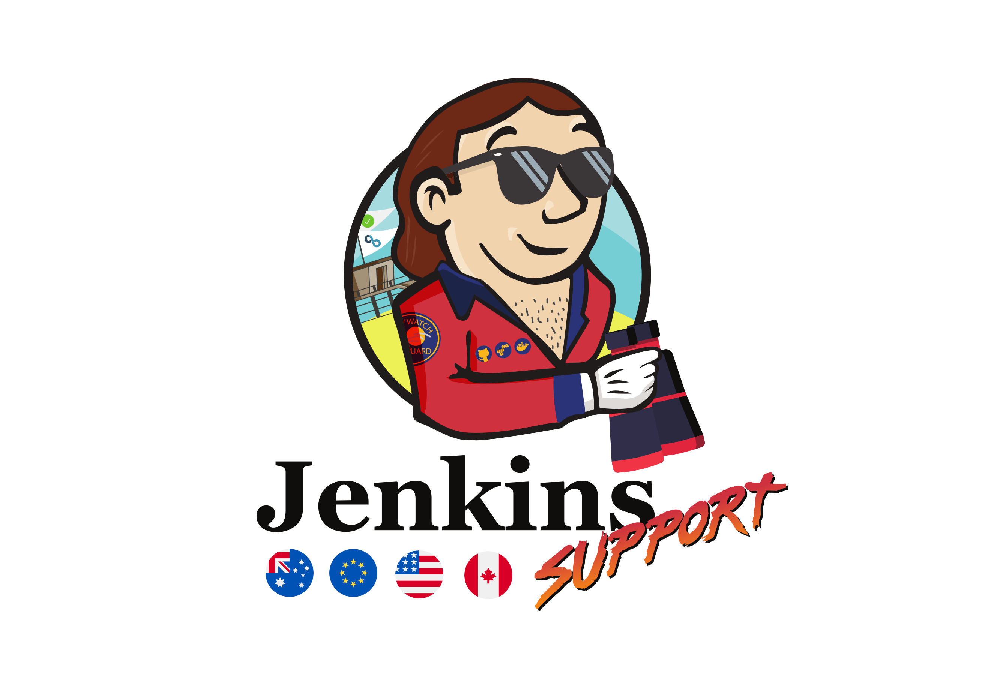

# CBCI Admins Library - `main`

  
  
Welcome to my CBCI Admins Library, a storage place for my assets related to my journey around Jenkins and CloudBees CI Administration

---

  

CloudBees CI admin library is separated into 2 branches:

- [main](https://github.com/carlosrodlop/cbci.jenkins-libs/tree/main): Admin resources beyond the Pipeline scope.
  - [Operate Remotely with CloudBeesCI](remote)
    - [Jenkins CLI](remote/cli)
    - [Jenkins API-REST](remote/rest-api)
  - [Groovy scripts automation](src/script)
- [pipelines](https://github.com/carlosrodlop/cbci.jenkins-libs/tree/pipelines): Compatible with `Jenkins Shared Libraries` and `CloudBees Pipeline Template Catalog` structures.

For Configuration as Code there are separate repositories:

- [carlosrodlop/cb-casc-oc](https://github.com/carlosrodlop/cb-casc-oc)
- [carlosrodlop/cb-casc-controllers](https://github.com/carlosrodlop/cb-casc-oc)

## Awesome

- [Awesome Jenkins / CloudBees CI Repos](https://github.com/stars/carlosrodlop/lists/jenkins-cloudbees-ci)
- [CloudBees Docs](https://aws.amazon.com/)
- [Jenkins IO](https://www.jenkins.io/)
- [Old Jenkins Wiki](https://wiki.jenkins-ci.org/)
- [Jenkins Instance Dogfooding](https://ci.jenkins.io/)
- [Jenkins Jira](https://issues.jenkins.io/secure/Dashboard.jspa)

### Groovy

- [Jenkins Javadoc: Core and plugins](https://javadoc.jenkins.io/)
- [Script Console](https://www.jenkins.io/doc/book/managing/script-console/)
- [Script Console - Example of groovy scripts](https://www.jenkins.io/doc/book/managing/script-console/#example-groovy-scripts)
- [Write Groovy scripts for Jenkins with code completion](https://www.mdoninger.de/2011/11/07/write-groovy-scripts-for-jenkins-with-code-completion.html)
