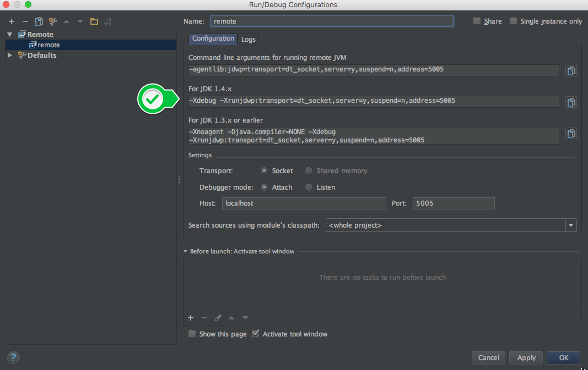
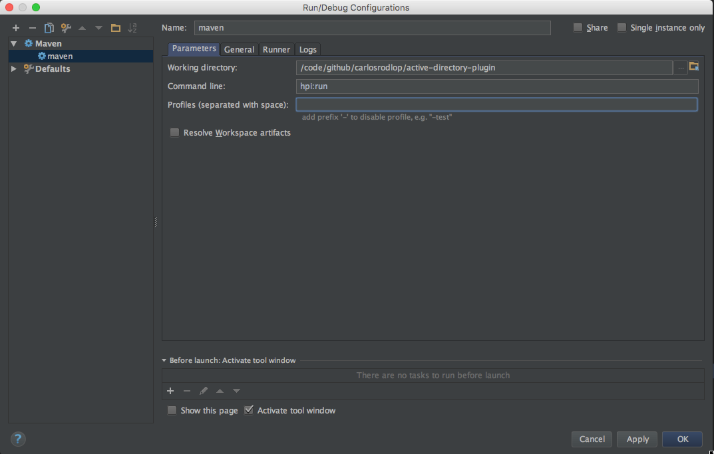

# Notebook

## Index

1. [Logs](#logs)
2. [Debugging](#jenkins_debug)

## Logs

When you work on support for CloudBees CI you need to understand logs...

### Initialization

Ref: [Milestones][]

* Running `jenkins.war`. Running from: jenkins.war
* CJP HA Configuration
  * `INFO: Cluster membership has changed to:`
  * `INFO: New primary node is JenkinsClusterMemberIdentity[member=MacBook-Pro-de-Carlos-56214 (240 bytes),weight=0,min=0].ha.singleton.HASingleton reactToPrimarySwitch`
  * `INFO: Elected as the primary node`
* Detecting `$JENKINS_HOME`
  * `webroot: EnvVars.masterEnvVars.get("JENKINS_HOME")`
  * `INFO: Jenkins home directory: /.../jenkins-home found at: EnvVars.masterEnvVars.get("JENKINS_HOME")`

```sh
Listening for transport dt_socket at address: 8000
Running from: /opt/var/jenkins-home/jenkins.war
webroot: EnvVars.masterEnvVars.get(JENKINS_HOME)
Sep 01, 2017 11:12:04 AM Main deleteWinstoneTempContents
WARNING: Failed to delete the temporary Winstone file /var/folders/pb/96bj7y8j449bbh4vl6zw9fkc0000gn/T/winstone/jenkins.war
Sep 01, 2017 11:12:04 AM org.eclipse.jetty.util.log.JavaUtilLog info
INFO: Logging initialized @1292ms
Sep 01, 2017 11:12:04 AM winstone.Logger logInternal
INFO: Beginning extraction from war file
Sep 01, 2017 11:12:09 AM org.eclipse.jetty.util.log.JavaUtilLog warn
WARNING: Empty contextPath
Sep 01, 2017 11:12:09 AM org.eclipse.jetty.util.log.JavaUtilLog info
INFO: jetty-9.2.z-SNAPSHOT
Sep 01, 2017 11:12:11 AM org.eclipse.jetty.util.log.JavaUtilLog info
INFO: NO JSP Support for /, did not find org.eclipse.jetty.jsp.JettyJspServlet
Sep 01, 2017 11:12:11 AM com.cloudbees.jenkins.infradna.backup.RestoreServletListener contextInitialized
INFO: Jenkins restore listener found no infradna-backup-restore.properites, continuing without restore.
Sep 01, 2017 11:12:11 AM com.cloudbees.jenkins.ha.AbstractJenkinsSingleton contextInitialized
INFO: Jenkins home directory: /opt/var/jenkins-home found at: EnvVars.masterEnvVars.get("JENKINS_HOME")
Sep 01, 2017 11:12:11 AM com.cloudbees.jenkins.ha.singleton.HASingleton createChannel
INFO: Loading default configuration from jar:file:/opt/var/jenkins-home/war/WEB-INF/lib/jenkins-ha-4.7.jar!/com/cloudbees/jenkins/ha/singleton/jgroups-jenkins.xml using HA_JGROUPS_DIR=/opt/var/jenkins-home/jgroups
Sep 01, 2017 11:12:12 AM org.jgroups.stack.DiagnosticsHandler bindToInterfaces
WARNING: failed to join /224.0.75.75:7500 on awdl0: java.net.SocketException: Cant assign requested address


GMS: address=MacBook-Pro-de-Carlos-56214 (240 bytes), cluster=Jenkins, physical address=192.168.0.12:52905

Sep 01, 2017 11:12:12 AM com.cloudbees.jenkins.ha.singleton.HASingleton3 viewAccepted
INFO: Cluster membership has changed to: [MacBook-Pro-de-Carlos-56214 (240 bytes)|0] [MacBook-Pro-de-Carlos-56214 (240 bytes)]
Sep 01, 2017 11:12:12 AM com.cloudbees.jenkins.ha.singleton.HASingleton3 viewAccepted
INFO: New primary node is JenkinsClusterMemberIdentity[member=MacBook-Pro-de-Carlos-56214 (240 bytes),weight=0,min=0]
Sep 01, 2017 11:12:12 AM com.cloudbees.jenkins.ha.singleton.HASingleton reactToPrimarySwitch
INFO: Elected as the primary node
Jenkins home directory: /opt/var/jenkins-home found at: SystemProperties.getProperty(JENKINS_HOME)
Sep 01, 2017 11:12:13 AM org.eclipse.jetty.util.log.JavaUtilLog info
INFO: Started w.@121c54fa{/,file:/Users/carlosrodlop/Support/cases/52638/015-Working_cloudbees-support_CM-rtg-jenkins-use-prod.cicd.spglobal.com_2017-08-30_14.39.30/jenkins-home/war/,AVAILABLE}{/Users/carlosrodlop/Support/cases/52638/015-Working_cloudbees-support_CM-rtg-jenkins-use-prod.cicd.spglobal.com_2017-08-30_14.39.30/jenkins-home/war
Sep 01, 2017 11:12:13 AM org.eclipse.jetty.util.log.JavaUtilLog info
INFO: Started ServerConnector@57ce634f{HTTP/1.1}{127.0.0.1:8181}
Sep 01, 2017 11:12:13 AM org.eclipse.jetty.util.log.JavaUtilLog info
INFO: Started @10055ms
Sep 01, 2017 11:12:13 AM winstone.Logger logInternal
INFO: Winstone Servlet Engine v2.0 running: controlPort=disabled
Sep 01, 2017 11:12:17 AM jenkins.InitReactorRunner1 onAttained
```

##### `INFO: Started initialization`

```sh
Aug 29, 2017 1:37:37 AM com.cloudbees.jenkins.cjp.installmanager.CJPPluginManager$URLInstaller install
INFO: Requested [INSTALL] of plugin [nectar-license] to version [8.6] completed
Aug 29, 2017 1:37:42 AM jenkins.InitReactorRunner$1 onAttained
```

##### `INFO: Listed all plugins`

Checking **plugin status**

* [Optional] `SEVERE: Failed Loading plugin Pipeline SCM API for Blue Ocean v1.1.2 (blueocean-pipeline-scm-api)`

```sh
Aug 29, 2017 1:37:43 AM org.apache.sshd.common.util.SecurityUtils$BouncyCastleRegistration run
INFO: BouncyCastle already registered as a JCE provider
Aug 29, 2017 1:37:43 AM ruby.RubyRuntimePlugin start
INFO: Injecting JRuby into XStream
Aug 29, 2017 1:37:55 AM hudson.plugins.ansicolor.PluginImpl start
INFO: AnsiColor: eliminating boring output (https://github.com/dblock/jenkins-ansicolor-plugin)
Aug 29, 2017 1:37:58 AM jenkins.InitReactorRunner$1 onTaskFailed
SEVERE: Failed Loading plugin Pipeline SCM API for Blue Ocean v1.1.2 (blueocean-pipeline-scm-api)
java.io.IOException: Pipeline SCM API for Blue Ocean v1.1.2 failed to load.
 - REST API for Blue Ocean v1.0.1 is older than required. To fix, install v1.1.2 or later.
 at hudson.PluginWrapper.resolvePluginDependencies(PluginWrapper.java:621)
 at hudson.PluginManager$2$1$1.run(PluginManager.java:517)
 at org.jvnet.hudson.reactor.TaskGraphBuilder$TaskImpl.run(TaskGraphBuilder.java:169)
 at org.jvnet.hudson.reactor.Reactor.runTask(Reactor.java:282)
 at jenkins.model.Jenkins$7.runTask(Jenkins.java:1089)
 at org.jvnet.hudson.reactor.Reactor$2.run(Reactor.java:210)
 at org.jvnet.hudson.reactor.Reactor$Node.run(Reactor.java:117)
 at java.util.concurrent.ThreadPoolExecutor.runWorker(ThreadPoolExecutor.java:1142)
 at java.util.concurrent.ThreadPoolExecutor$Worker.run(ThreadPoolExecutor.java:617)
 at java.lang.Thread.run(Thread.java:748)

Aug 29, 2017 1:38:08 AM jenkins.InitReactorRunner$1 onAttained
```

##### `INFO: Prepared all plugins`

```sh
Aug 29, 2017 1:38:09 AM com.cloudbees.tiger.plugins.palace.PalaceOneShotConfiguration <init>
INFO: Palace One-shot provisioner is disabled
Aug 29, 2017 1:38:09 AM hudson.ExtensionFinder$GuiceFinder$FaultTolerantScope$1 error
INFO: Failed to instantiate optional component com.cloudbees.hudson.plugins.modeling.integrations.promoted_builds.PromotionProcessTemplateProperty$DescriptorImpl; skipping
Aug 29, 2017 1:38:10 AM hudson.ExtensionFinder$GuiceFinder$FaultTolerantScope$1 error
INFO: Failed to instantiate optional component hudson.plugins.build_timeout.operations.AbortAndRestartOperation$DescriptorImpl; skipping
Aug 29, 2017 1:38:10 AM jenkins.InitReactorRunner$1 onAttained
```

##### `INFO: Started all plugins`

```sh
Aug 29, 2017 1:38:10 AM jenkins.InitReactorRunner$1 onAttained
```

##### `INFO: Augmented all extensions`

Checking **job status**

* [Optional] INFO: Loading job prpc-platform/feature%2Fcipar (291.7%)
* [Optional] WARNING: could not find file /opt/var/jenkins-home/jobs/prpc-platform/branches/feature%2Fpipeline%2Fsachin/config.xml

```sh
Aug 29, 2017 1:38:13 AM com.cloudbees.opscenter.context.config.ConfigurationSnippetRefresher <init>
INFO: ConfigurationSnippetRefresher configured with recurrence period of 60,000ms
Aug 29, 2017 1:39:28 AM com.cloudbees.hudson.plugins.folder.AbstractFolder loadChildren
WARNING: could not find file /var/jenkins_home/jobs/prpc-platform/branches/feature%2Fpipeline%2Fsachin/config.xml
Aug 29, 2017 1:39:40 AM com.cloudbees.hudson.plugins.folder.AbstractFolder$3 call
INFO: Loading job prpc-platform/feature%2Fcipar (291.7%)
Aug 29, 2017 1:39:42 AM com.cloudbees.hudson.plugins.folder.AbstractFolder loadChildren
WARNING: could not find file /var/jenkins_home/jobs/prpc-platform/branches/feature-pipe.m2kssm.ne-cbjrun-24/config.xml
Aug 29, 2017 1:39:42 AM com.cloudbees.hudson.plugins.folder.AbstractFolder loadChildren
WARNING: could not find file /var/jenkins_home/jobs/prpc-platform/branches/feature-pipe.4pauod.-cbjrun-3998/config.xml
Aug 29, 2017 1:39:42 AM com.cloudbees.hudson.plugins.folder.AbstractFolder loadChildren
WARNING: could not find file /var/jenkins_home/jobs/prpc-platform/branches/feature-pipeline-cbjrun-7.hohhsj/config.xml
Aug 29, 2017 1:39:44 AM com.cloudbees.hudson.plugins.folder.AbstractFolder loadChildren
WARNING: could not find file /var/jenkins_home/jobs/prpc-platform/branches/feature-pipe.2g450h.ne-cbjrun-23/config.xml
Aug 29, 2017 1:39:45 AM jenkins.InitReactorRunner$1 onAttained
```

##### `INFO: Loaded all jobs`

* Custom Configuration
  * Executing custom configuration, `INFO: Executing /var/jenkins_home/init.groovy.d`
  * `INFO: Loading from system properties`
* Check status: Disk space
* Set up and Start ports
* `INFO:License is valid, invoke configuration`
* `INFO: Obtained the latest update center data file for UpdateSource jenkins-enterprise`

```sh
Aug 29, 2017 1:39:45 AM com.cloudbees.opscenter.context.Messaging$Local open
INFO: Starting Messaging
Aug 29, 2017 1:39:45 AM jenkins.util.groovy.GroovyHookScript execute
INFO: Executing /var/jenkins_home/init.groovy.d/init_01_launch_configure_jenkins.groovy
Aug 29, 2017 1:39:45 AM com.cloudbees.opscenter.client.plugin.OperationsCenterRootAction$DescriptorImpl initiate
INFO: Loading from system properties
Aug 29, 2017 1:39:45 AM com.cloudbees.simplediskusage.QuickDiskUsagePlugin$3 run
INFO: Waiting for Jenkins to be up before computing disk usage
Aug 29, 2017 1:39:45 AM com.cloudbees.jce.plugins.tenant.cleanup.CleanupService getRecurrencePeriod
INFO: Not starting cleanup service for tenant platform
Aug 29, 2017 1:39:45 AM com.cloudbees.jce.plugins.tenant.cleanup.CleanupService getRecurrencePeriod
INFO: Not starting cleanup service for tenant platform
Aug 29, 2017 1:39:45 AM hudson.model.AsyncPeriodicWork$1 run
INFO: Started Download metadata
Aug 29, 2017 1:39:45 AM org.jenkinsci.main.modules.sshd.SSHD start
INFO: Started SSHD at port 31904
Aug 29, 2017 1:39:45 AM org.springframework.context.support.AbstractApplicationContext prepareRefresh
INFO: Refreshing org.springframework.web.context.support.StaticWebApplicationContext@4e8e6919: display name [Root WebApplicationContext]; startup date [Tue Aug 29 01:39:45 EDT 2017]; root of context hierarchy
Aug 29, 2017 1:39:45 AM org.springframework.context.support.AbstractApplicationContext obtainFreshBeanFactory
INFO: Bean factory for application context [org.springframework.web.context.support.StaticWebApplicationContext@4e8e6919]: org.springframework.beans.factory.support.DefaultListableBeanFactory@5b196415
Aug 29, 2017 1:39:45 AM org.springframework.beans.factory.support.DefaultListableBeanFactory preInstantiateSingletons
INFO: Pre-instantiating singletons in org.springframework.beans.factory.support.DefaultListableBeanFactory@5b196415: defining beans [filter,legacy]; root of factory hierarchy
Aug 29, 2017 1:39:47 AM java_util_logging_Logger$info$0 call
INFO:License is valid, invoke configuration
Aug 29, 2017 1:39:47 AM jenkins.util.groovy.GroovyHookScript execute
INFO: Executing /var/jenkins_home/configure-jenkins.groovy.d/01-master-executors.groovy
Aug 29, 2017 1:39:47 AM jenkins.util.groovy.GroovyHookScript execute
INFO: Executing /var/jenkins_home/configure-jenkins.groovy.d/02-first-start-create-eval-job.groovy
Aug 29, 2017 1:39:47 AM jenkins.util.groovy.GroovyHookScript execute
INFO: Executing /var/jenkins_home/configure-jenkins.groovy.d/03-fixed-sshd-port.groovy
Aug 29, 2017 1:39:48 AM jenkins.util.groovy.GroovyHookScript execute
INFO: Executing /var/jenkins_home/init.groovy.d/tcp-slave-agent-port.groovy
Aug 29, 2017 1:39:48 AM com.cloudbees.jenkins.plugins.license.nectar.CloudBeesUpdateSite updateData
INFO: Obtained the latest update center data file for UpdateSource jenkins-enterprise
Aug 29, 2017 1:39:48 AM hudson.model.DownloadService$Downloadable load
INFO: Obtained the updated data file for hudson.tasks.Maven.MavenInstaller
Aug 29, 2017 1:39:48 AM hudson.model.DownloadService$Downloadable load
INFO: Obtained the updated data file for hudson.tasks.Ant.AntInstaller
Aug 29, 2017 1:39:49 AM hudson.model.DownloadService$Downloadable load
INFO: Obtained the updated data file for hudson.plugins.gradle.GradleInstaller
Aug 29, 2017 1:39:49 AM hudson.model.DownloadService$Downloadable load
INFO: Obtained the updated data file for hudson.plugins.groovy.GroovyInstaller
Aug 29, 2017 1:39:49 AM hudson.model.DownloadService$Downloadable load
INFO: Obtained the updated data file for hudson.tools.JDKInstaller
Aug 29, 2017 1:39:49 AM hudson.model.AsyncPeriodicWork$1 run
INFO: Finished Download metadata. 4,555 ms
Aug 29, 2017 1:39:52 AM com.cloudbees.jenkins.plugins.assurance.FullUpgradeCache$Loader run
INFO: Envelope metadata for [cje-mm] version [2.60.3.1] loaded
Aug 29, 2017 1:39:52 AM com.cloudbees.jenkins.plugins.license.nectar.CloudBeesUpdateSite updateData
INFO: Obtained the latest update center data file for UpdateSource cap-cje-mm
Aug 29, 2017 1:39:52 AM com.cloudbees.jenkins.plugins.license.nectar.CloudBeesUpdateSite updateData
INFO: **Obtained the latest update center data file** for UpdateSource cje-mm-offline
Aug 29, 2017 1:39:52 AM hudson.model.DownloadService$Downloadable load
INFO: Obtained the updated data file for hudson.tasks.Maven.MavenInstaller
Aug 29, 2017 1:39:52 AM hudson.model.DownloadService$Downloadable load
INFO: Obtained the updated data file for hudson.tasks.Ant.AntInstaller
Aug 29, 2017 1:39:52 AM com.cloudbees.jenkins.plugins.assurance.model.UpdateSiteEnvelopeProvider get
INFO: Loading envelopes embedded in UpdateSite cap-cje-mm
Aug 29, 2017 1:39:52 AM hudson.model.DownloadService$Downloadable load
INFO: Obtained the updated data file for hudson.plugins.gradle.GradleInstaller
Aug 29, 2017 1:39:52 AM hudson.model.DownloadService$Downloadable load
INFO: Obtained the updated data file for hudson.plugins.groovy.GroovyInstaller
Aug 29, 2017 1:39:53 AM hudson.model.DownloadService$Downloadable load
INFO: Obtained the updated data file for hudson.tools.JDKInstaller
Aug 29, 2017 1:40:03 AM java_util_logging_Logger$info$0 call
INFO: Set SSHD port to 31236
Aug 29, 2017 1:40:03 AM org.jenkinsci.main.modules.sshd.SSHD start
INFO: Started SSHD at port 31236
Aug 29, 2017 1:40:07 AM com.cloudbees.opscenter.client.plugin.OperationsCenterRootAction$DescriptorImpl setEnabledState
INFO: Enabled
Aug 29, 2017 1:40:07 AM jenkins.InitReactorRunner$1 onAttained
```

##### `INFO: Completed initialization`

* [Optional] Check Connectivity Ops Center Client - Server
* Health Check `WARNING: Some health checks are reporting as unhealthy: [plugins : There are 1 failed plugins: blueocean-pipeline-scm-api]`
* [Optional] Sending Alerts

```sh
Aug 29, 2017 1:40:08 AM com.cloudbees.opscenter.client.plugin.OperationsCenterRootAction$DescriptorImpl setApprovedState
INFO: Approved
Aug 29, 2017 1:40:08 AM com.cloudbees.opscenter.client.plugin.OperationsCenterRootAction$DescriptorImpl setConnectedState
INFO: Connected
Aug 29, 2017 1:40:32 AM hudson.triggers.SafeTimerTask run
SEVERE: Timer task com.cloudbees.opscenter.analytics.reporter.items.ItemSubmissionQueue@75c1bea4 failed
java.lang.ClassCastException: com.cloudbees.opscenter.analytics.reporter.items.Locator$NodeInfoLocator cannot be cast to com.cloudbees.opscenter.analytics.reporter.items.Change
 at com.cloudbees.opscenter.analytics.reporter.items.ItemSubmissionQueue.doRun(ItemSubmissionQueue.java:157)
 at hudson.triggers.SafeTimerTask.run(SafeTimerTask.java:50)
 at java.util.concurrent.Executors$RunnableAdapter.call(Executors.java:511)
 at java.util.concurrent.FutureTask.runAndReset(FutureTask.java:308)
 at java.util.concurrent.ScheduledThreadPoolExecutor$ScheduledFutureTask.access$301(ScheduledThreadPoolExecutor.java:180)
 at java.util.concurrent.ScheduledThreadPoolExecutor$ScheduledFutureTask.run(ScheduledThreadPoolExecutor.java:294)
 at java.util.concurrent.ThreadPoolExecutor.runWorker(ThreadPoolExecutor.java:1142)
 at java.util.concurrent.ThreadPoolExecutor$Worker.run(ThreadPoolExecutor.java:617)
 at java.lang.Thread.run(Thread.java:748)

Aug 29, 2017 1:40:32 AM hudson.triggers.SafeTimerTask run
SEVERE: Timer task com.cloudbees.opscenter.analytics.reporter.items.ItemSubmissionQueue@75c1bea4 failed
java.lang.ClassCastException: com.cloudbees.opscenter.analytics.reporter.items.Locator$NodeInfoLocator cannot be cast to com.cloudbees.opscenter.analytics.reporter.items.Change
 at com.cloudbees.opscenter.analytics.reporter.items.ItemSubmissionQueue.doRun(ItemSubmissionQueue.java:157)
 at hudson.triggers.SafeTimerTask.run(SafeTimerTask.java:50)
 at java.util.concurrent.Executors$RunnableAdapter.call(Executors.java:511)
 at java.util.concurrent.FutureTask.runAndReset(FutureTask.java:308)
 at java.util.concurrent.ScheduledThreadPoolExecutor$ScheduledFutureTask.access$301(ScheduledThreadPoolExecutor.java:180)
 at java.util.concurrent.ScheduledThreadPoolExecutor$ScheduledFutureTask.run(ScheduledThreadPoolExecutor.java:294)
 at java.util.concurrent.ThreadPoolExecutor.runWorker(ThreadPoolExecutor.java:1142)
 at java.util.concurrent.ThreadPoolExecutor$Worker.run(ThreadPoolExecutor.java:617)
 at java.lang.Thread.run(Thread.java:748)

Aug 29, 2017 1:40:39 AM jenkins.metrics.api.Metrics$HealthChecker execute
WARNING: Some health checks are reporting as unhealthy: [plugins : There are 1 failed plugins: blueocean-pipeline-scm-api]
Aug 29, 2017 1:40:50 AM com.cloudbees.jenkins.plugin.metrics.views.Alerter$Condition checkState
INFO: Sending alert com.cloudbees.jenkins.plugin.metrics.views.HealthCheckConditionSource$IndividualHealthCheckCondition[name='Health checks failing: [plugins]'] status failing
Aug 29, 2017 1:40:50 AM com.cloudbees.jenkins.plugin.metrics.views.Alerter$Condition checkState
INFO: Sending alert com.cloudbees.jenkins.plugin.metrics.views.HealthCheckConditionSource$IndividualHealthCheckCondition[name='Health checks failing: [plugins]'] status failing
Aug 29, 2017 1:40:52 AM hudson.triggers.SafeTimerTask run
SEVERE: Timer task com.cloudbees.opscenter.analytics.reporter.items.ItemSubmissionQueue@75c1bea4 failed
java.lang.ClassCastException: com.cloudbees.opscenter.analytics.reporter.items.Locator$NodeInfoLocator cannot be cast to com.cloudbees.opscenter.analytics.reporter.items.Change
 at com.cloudbees.opscenter.analytics.reporter.items.ItemSubmissionQueue.doRun(ItemSubmissionQueue.java:157)
 at hudson.triggers.SafeTimerTask.run(SafeTimerTask.java:50)
 at java.util.concurrent.Executors$RunnableAdapter.call(Executors.java:511)
 at java.util.concurrent.FutureTask.runAndReset(FutureTask.java:308)
 at java.util.concurrent.ScheduledThreadPoolExecutor$ScheduledFutureTask.access$301(ScheduledThreadPoolExecutor.java:180)
 at java.util.concurrent.ScheduledThreadPoolExecutor$ScheduledFutureTask.run(ScheduledThreadPoolExecutor.java:294)
 at java.util.concurrent.ThreadPoolExecutor.runWorker(ThreadPoolExecutor.java:1142)
 at java.util.concurrent.ThreadPoolExecutor$Worker.run(ThreadPoolExecutor.java:617)
 at java.lang.Thread.run(Thread.java:748)

Aug 29, 2017 1:41:17 AM hudson.WebAppMain$3 run
```

##### `INFO: Jenkins is fully up and running`

### Shutting down

#### Shutting down the JVM

Options:

* Ctrl + C
* kill -9 <PID>
* System.exit(0)

##### `INFO: JVM is terminating. Shutting down Jetty`

#### Shutting down Jenkins

* [Restart or Saferestart](https://github.com/jenkinsci/jenkins/blob/master/core/src/main/java/jenkins/model/Jenkins.java)

##### `SEVERE: Restarting VM as requested by <jenkinsUsers>`

#### Agents

##### JNLP

```
Aug 29, 2017 2:18:29 AM hudson.TcpSlaveAgentListener$ConnectionHandler run
INFO: Accepted connection** #4 from /172.28.2.16:39952
...
Aug 29, 2017 2:27:42 AM jenkins.slaves.DefaultJnlpSlaveReceiver channelClosed
WARNING: Computer.threadPoolForRemoting [#77] for 29e0b48f terminated
java.nio.channels.ClosedChannelException
```

##### Share Agents Provisioning

```sh
2017-10-19 13:25:02.040+0000 [id=82]    INFO    hudson.slaves.NodeProvisioner$2#run: Jenkins-Shared-Agent-Example1 provisioning successfully completed. We have now 25 computer(s)
...
2017-10-19 14:35:02.054+0000 [id=61]    INFO    hudson.slaves.NodeProvisioner$2#run: Jenkins-Shared-Agent-Example2 provisioning successfully completed. We have now 27 computer(s)
```

### Job Builds

completed: ABORTED

```sh
Aug 29, 2017 1:46:37 AM org.jenkinsci.plugins.workflow.job.WorkflowRun finish
INFO: prpc-platform/master #729 completed: ABORTED
```

completed: SUCCESS

```sh
Aug 29, 2017 2:18:29 AM org.jenkinsci.plugins.workflow.job.WorkflowRun finish
INFO: CleanupDanglingContainers #543 completed: SUCCESS
```

completed: FAILURE

```sh
Aug 29, 2017 2:28:18 AM org.jenkinsci.plugins.workflow.job.WorkflowRun finish
INFO: prpc-platform-squid-pr #39 completed: FAILURE
```

[Milestones]:https://github.com/jenkinsci/jenkins/blob/08def67a18eee51de9f3f99bc2a792fee1c160e0/core/src/main/java/hudson/init/InitMilestone.java

## Jenkins_Debug

[Plugin Tutorial](https://wiki.jenkins-ci.org/display/JENKINS/Plugin+tutorial)

### Maven

* Parent `pom.xml`, the newest version —> Many properties are taken from it —> available profiles for testing
* packing —> `.hpi` —> current distribution of the plugin
* Jenkins version —> Usually LTS. Pick the latest LTS not too younght not too old —> Test agains, Build
* To run  `hpi:run` —> `target:goal` to run the project —> compile everything, install dependencies for your test env, a run the plugin within a instance of Jenkins OSS

###  Tips

* The plugin and core should be in the right version where you try to debug
`git checkout tags/<tag> -b <branch>`
* `Manifest.inf` —> file that the jenkins taken care for Update Centre —> it’s been taken form the artfifactid (do not include things like: “jenkins”, “cloudbees”, … ) —> It is not possible to refactor it afterwards

###  At Code Level

* `@extension` extends to “any step in jenkins” for instance: Builders, Triggers, etc…
* `@DataBoundConstructors` —> should use for something that it is mandatory for start.
* `@DataBoundSetter` —> something that is optional
* `@Symbol` Java tag in the description of the plugin is used for Pipeline as well as JobDSL
* On your Class name of the property, setter and getter should match with the jelly’s tag field in order to create object properly —> References:

  * <https://wiki.jenkins-ci.org/display/JENKINS/Basic+guide+to+Jelly+usage+in+Jenkins>
  * <https://wiki.jenkins-ci.org/display/JENKINS/UI+Samples+Plugin>

* Jenkins API, from the plugin you can get access to a full method available from the API, some examples are:

  * `listener.getLogger().println(“number of build” + build.id )`
  * Do thing inside the Agent:

    * `workspace.child(write). … —> to write something with a file do
    * luncher.lauch().cmd

* Actions —> Something that extend the UI and put actions in certain things node, folder, etc.. It can pull anything related to date and so on. You can also define some REST methods
* [Extension Points](https://wiki.jenkins-ci.org/display/JENKINS/Extension+points) —>Entry point to the plugin in the API jenkins ExtensionList for that jenkins installation. You can define your own API within your plugin by implementing “ExtensionPoint" —> The the class which make use of it need to extend for the API you created plus it needs the @Extension tag
* Some stuff that suppose to run well on the master not necessarily needs to be done in agents —> Most of the times could be related to Serialisation
* If you want to share something among different plugins is more advisable to create a plugins which contains those dependencies
* To make plugins compatible they need to pick up the same dependency of jenkins core

### IntelliJ Debugging

#### Core: Remote

1.- Open its `pom.xml`

2.- Terminal > mvn `-Dmaven.test.skip=true` clean package

3.- Debug > Edit configuration > + > Remote



Note: Copy for JDK 1.4.x inline to use if in (4)

4.- java -DJENKINS_HOME=jenkins-home -Xdebug -Xrunjdwp:transport=dt_socket,server=y,suspend=n,address=5005 -jar war/target/jenkins.war

5.- Hit Debug mode

#### Plugins

##### Option 1: Maven-Run

By default, use this method unless you find a problem.

1.- Open its `pom.xml`

2.- Debug > Edit configuration > + > Maven

* Name: Maven-Run
* Command line: `mvn hpi:run`



3.- Hit Debug mode

##### Option 2: Remote

In the case, you need to connect to the support bundle.

**Prerequesite**: The JVM needs to run using the following parameters: `-Xdebug -Xrunjdwp:transport=dt_socket,suspend=n,server=y,address=<IP>:<DEBUG_PORT>`

1.- Open its `pom.xml`

2.- Debug > Edit configuration > + > Remote

* `Host`: localhost - For support bundle change the port number to the one is using. example: 5000 --> 9000 (DEBUG PORT for CJOC, no the HTTP one).

* `Host`: <IP> - To connect to any external application (AWS, GCP) it requires a Public IP on the machine and your local IP (where you are debugging from) should have access to it. Note the Debug `Port` should be available too.

3.- Hit Debug mode

To debug changes

1) Easy/short changes uses Watch under variables: <https://www.jetbrains.com/help/idea/adding-editing-and-removing-watches.html>
2) Long changes
2.1) Create a snapshot version pom.xml
2.2) Compile de plugin (`mvn clean package -Dmaven.test.skip=true`)
2.3) Install Manually de plugin
3.4) Restart the instance
3.5) Debug

##### For Option 1 and 2: Test all the changes

Two options here:

* `mvn clean package -Dmaven.test.skip=true`
* Run all unit Test for the project > Place on Test folder > java > Run 'All Test'
